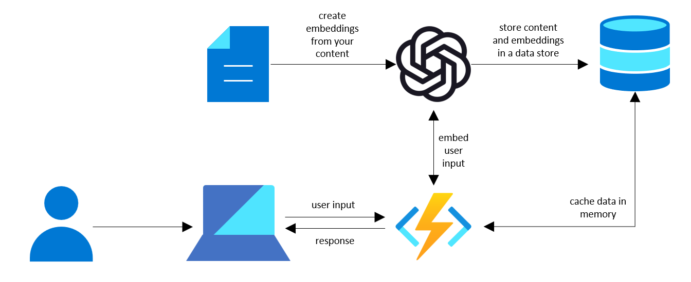

# Embeddings retrieval with Azure Functions

For scenarios with a small number of embeddings (less than 10,000), the simplest option is to cache the data in memory within your application and only refresh the data when needed. This works well at small scales because the data is small enough to easily fit in memory, can be pulled from the data source in a few seconds, and it only takes a few milliseconds to compare all of the embeddings to the user input.

In this example, we use an Azure Function to find the most similar vectors and an Azure Table to store the data, but you could follow this same pattern with other data stores and compute options.


## Architecture Overview


In this approach, we need two main components:
1. A primary data store - in this case, we use an Azure Table but you could also work with Azure SQL, Cosmos DB, or any other data store you prefer.
2. A compute resource - in this case, we use an Azure Function but you could also leverage a similar approach within your existing application or other places such as an App Service or Container Instance. The important thing is that you have compute that can cache data in memory so you don't need to reload the data for every call. When using an Azure Function, it's important to host it on a premium plan or in an App Service plan so that the cache is more persistent.

The Azure function receives the text as an input

1. Convert input text to an embedding
2. Find the `n` most similar embeddings to the input embedding
3. Return the text from the most similar embeddings

Optionally, you could also create your prompt and send it to the completion API withing the Azure Function. This would allow you to encapsulate all of the business logic in one place.

## Running the Azure Function

### Setting up your environment

For more details see how to [Create a function in Azure with Python using Visual Studio Code](https://learn.microsoft.com/azure/azure-functions/create-first-function-vs-code-python?pivots=python-mode-configuration)

1. Make sure you have the following items installed:
    * The [Azure Functions Core Tools](https://learn.microsoft.com/azure/azure-functions/functions-run-local?tabs=v4) version 4.x.
    * [Visual Studio Code](https://code.visualstudio.com/) on one of the supported platforms.
    * The [Python extension](https://marketplace.visualstudio.com/items?itemName=ms-python.python) for Visual Studio Code.
    * The [Azure Functions extension](https://marketplace.visualstudio.com/items?itemName=ms-azuretools.vscode-azurefunctions) for Visual Studio Code

2. Create the following resources on Azure:
    * [Azure OpenAI Service]()
    * [Azure Function]()
    * [Azure Table]()

    > Important: Make sure to host your Azure Function on a Premium Plan or in an App Service plan. This important to ensure that the function's compute is persistent so that you don't have to reload the data as frequently.

3. Add the sample data to the Azure table by running [load_azure_table.ipynb](./load_azure_table.ipynb). If you have your own dataset, you can use that instead too.

4. Update the local.settings.json file to include the following parameters
    ```json
    {
        "IsEncrypted": false,
        "Values": {
            "AzureWebJobsStorage": "",
            "FUNCTIONS_WORKER_RUNTIME": "python",
            "azure_table_account_name": "",
            "azure_table_key": "",
            "azure_table_name": "",
            "open_ai_resource_name": "",
            "open_ai_deployment_name": "",
            "open_ai_api_version": "2022-12-01",
            "open_ai_api_key": ""
        }
    }
    ```

### Running the Azure Function locally

Follow the steps below to run the Azure Function locally.
1. Open Visual Studio code.
2. Open a terminal and navigate to this folder.
    ```cmd
    cd "Embeddings with Azure Functions"
    ```

3. Install the dependencies.
    ```cmd
    pip install -r requirements.txt
    ```

4. Run the Azure Function.
    ```cmd
    func start
    ```

5. Call the Azure Function. You can use [test_azure_function.ipynb](./test_azure_function.ipynb) to test the Azure Function or call the API directly.

    ```http
    POST localhost:7071/api/QueryEmbedding

    {
        "text": "I want to go to the beach",
        "n": 5,
        "force_reload": false
    }
    ```

### Deploying the Azure Function


To Deploy your Azure Function, see [deploy the project to Azure](https://learn.microsoft.com/azure/azure-functions/create-first-function-vs-code-python?pivots=python-mode-decorators#deploy-the-project-to-azure).