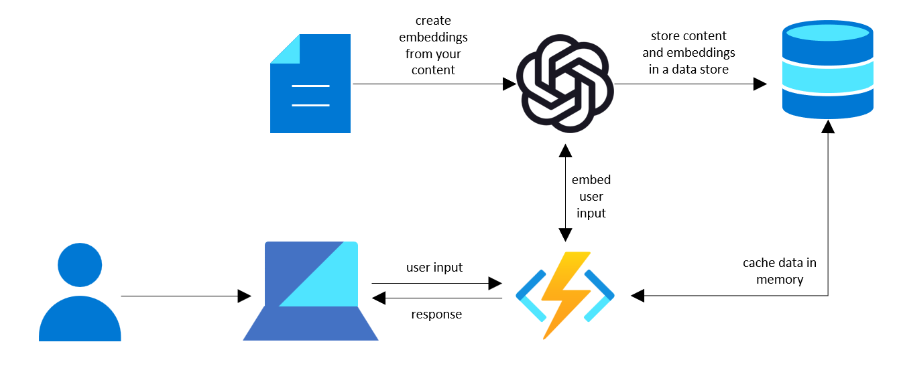
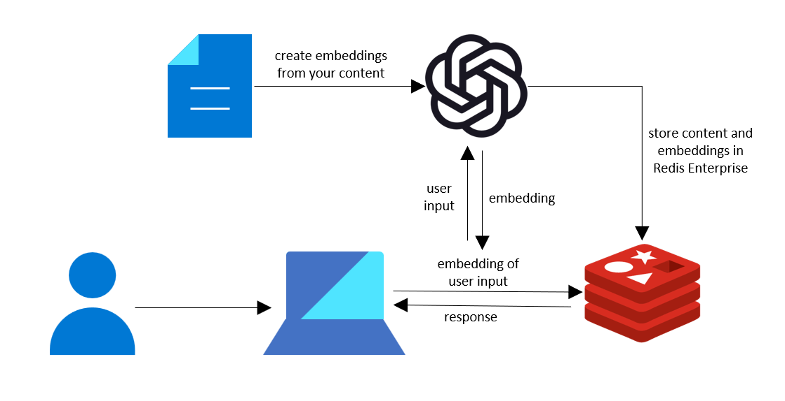

# Architectures for working with Embeddings on Azure

For scenarios like **question answering**, you need to include relevant information in your prompts to the Azure OpenAI Service. In some scenarios, you may be able to include all relevant text in the prompt, but **often you'll need to intelligently select the most relevant text to include** so that you can stay within the model's token limits.

OpenAI's embeddings APIs are a common way to find the most relevant text to include in the prompt. These APIs allow you to convert text to numerical representations that capture the semantic meaning of the text. With this, you can convert a user's query to an embedding, search for the most "similar" vectors, and find the most-relevant documents to the query -- **a technique known as vector search**.

When working with embeddings, you'll need a way to store the embeddings and perform search in real-time.
- At small scales, this is an easy problem to solve using libraries like [FAISS](https://faiss.ai/) and you can often just store the embeddings in memory in your application.
- At larger scales, you'll need a vector database that enables low-latency embedding retrieval and approximate nearest neighbors (ANN) search.

This folder shows options for working with embeddings on Azure at both small scales and large scales. The first option shows how to cache embeddings into an Azure Function for quick retrieval while the second option shows how you can use the RediSearch module in Redis Enterprise on Azure to perform vector search at larger scales.

## Architecture Options

### Choosing the right architecture

The best architecture for your scenario will depend on a few factors including the number of embeddings you have, how frequently you'll be updating the embeddings, and how much latency you can tolerate within your application.

Of these factors, the number of embeddings you have is the more important one. If you have less than 10,000 embeddings, you can use a simple in-memory solution like the one shown in the first option. Beyond that, you'll start to see higher latencies to perform the vector search and it will take more time to load the data from the data store into memory.

If you have a higher number of embeddings or need to be updating the embeddings index in real time, using a vector database like RediSearch is likely a better option.

### [Option 1: Embeddings retrieval with Azure Functions](./Embeddings%20with%20Azure%20Functions/README.md)

For scenarios with a small number of embeddings (less than 10,000), the simplest option is to create a vector index in application memory using Faiss and only refresh the data when needed. This works well at small scales because the data can **easily fit in memory**, can be pulled from the data source in a few seconds, and it only takes a few milliseconds to compare all of the embeddings to the user input.

In this example, we use an Azure Function with the Faiss library to do the processing and an Azure Table to store the data. You could follow this same pattern with other data stores, vector libraries, and compute options.

### [Option 2: Embeddings retrieval with RediSearch](./Embeddings%20with%20RediSearch/)

**Redis Enterprise on Azure** is a first-party service that supports approximate nearest neighbors search out of the box. ANN search in Redis is supported through the [RediSearch](https://redis.io/docs/stack/search/reference/vectors/) module which makes it a great option for scenarios when you need to search through a large number of embeddings or need to frequently update vectors/metadata in the index.

In this folder, we'll show you how to use RediSearch to work with OpenAI embeddings. We'll show you both how to use RediSearch from Azure Cache for Redis and also how to use it with a docker container.

There's another great example of how to use RediSearch with OpenAI embeddings at [https://github.com/ruoccofabrizio/azure-open-ai-embeddings-qna](https://github.com/ruoccofabrizio/azure-open-ai-embeddings-qna).

For more details and examples on using Redis for vector search, see:
- [Vector Similarity Search: From Basics to Production](https://mlops.community/vector-similarity-search-from-basics-to-production/)
- [AI-Powered Document Search in Redis](https://datasciencedojo.com/blog/ai-powered-document-search/)
- [Rediscover Redis for Vector Similarity Search](https://redis.com/blog/rediscover-redis-for-vector-similarity-search/)
- [arXiv Paper Search with Redis](https://github.com/RedisVentures/redis-arXiv-search)