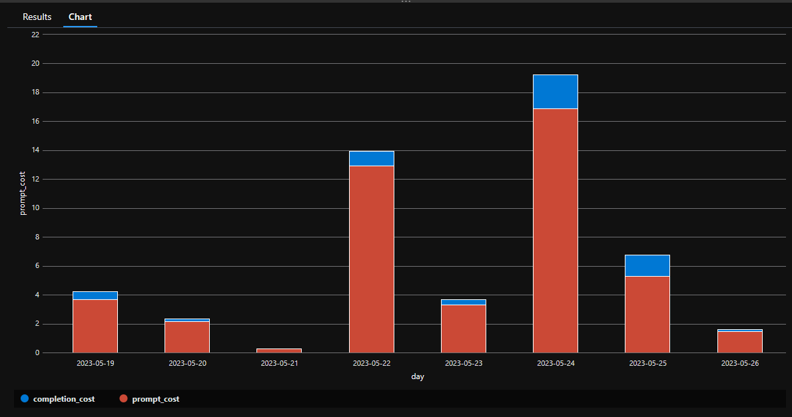
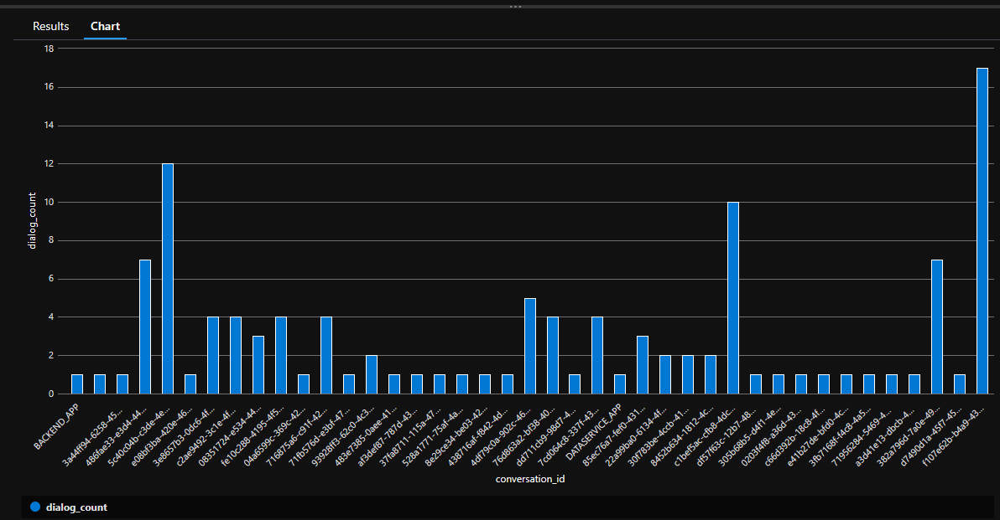

# Overview
This documents includes some sample KQL queries and report samples that were created based on the logs that were written as part of application execution. These are samples that can be extended for your own use.

## Estimating AOAI usage cost
This calculates AOAI consumption cost based on the number of tokens sent to AOAI and number of tokens created by AOAI services. Based on the tokens consumed, total cost is calculated by multiplying the numbers with the consumption cost based on the pricing listed [here](https://azure.microsoft.com/en-us/pricing/details/cognitive-services/openai-service/)

### KQL Query for estimating cost
Below query calculates cost. Do select the time range when executing this query
```
traces
| extend total_tokens = todouble(customDimensions.total_tokens)
| extend prompt_tokens = todouble(customDimensions.prompt_tokens)
| extend completion_tokens = todouble(customDimensions.completion_tokens)
| extend aoai_response_MS = tostring(customDimensions.["aoai_response[MS]"])
| extend day = format_datetime(timestamp, "yyyy-MM-dd")
| summarize prompt_cost=sum(prompt_tokens)/1000 * 0.03, completion_cost=sum(completion_tokens)/1000 * 0.06 by day
| order by day asc  
| render columnchart  

```

### Sample cost report 


## Conversation Depth
This calculates the length (number of unique dialogs) of each conversation. A dialog is what user said and what was the response for the bot for that utterance. Since this a multi-turn conversation, within a conversation there are multiple dialogs happening. One assumption could be drawn is that the more number of dialogs the more engaging the experience is.

### KQL Query
```
traces
| extend conversation_id = tostring(customDimensions.conversation_id)
| extend dialog_id = tostring(customDimensions.dialog_id)
| distinct conversation_id, dialog_id
| summarize dialog_count = count() by conversation_id
| render columnchart  
```

### Sample Conversation Depth Report
